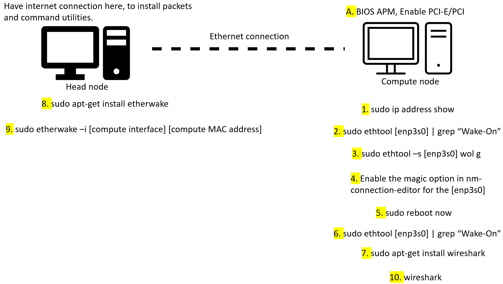

### **3.2 Setting up Wake-On-LAN magic packets communication**
---
 

 
<b>Figure 2: Implementing Wake-On-LAN between a head node and a compute node</b>
 

Following the letters and numbers on the above picture, below going to discuss the purpose of each line.

A. First, in the compute node BIOS, in the APM section related with power management, have to enable only the PCI-E/PCI, to enable Wake On LAN. It makes the compute node turn on when getting Wake on LAN magic packets only. Set the Restore AC Power LOSS to Power Off state.
1. To get the MAC address of compute node, which is a unique ID for the compute network interface.
2. To check the Wake-On-LAN state in the specific network interface. In initial, it will be d means disabled. Have to turn it on.
3. Here, making the Wake ON LAN activate by entering g at the end of the command.
4. However, after a reboot the WOL state will turn to d (disable). Therefore, have to make it persistent. In nm-connection-editor, by clicking magic, it will be persistent forever.
5. Reboot the compute node.
6. Verify whether the WOL is g or d state. It will be g, saying active state.
7. Install wireshark, which is a packet analyser. It will help to capture the incoming magic packets from compute node. Need only for testing purpose.
8. Install etherwake, to send Wake-On-LAN magic packets to compute node.
9. Sending a WOL magic packets to compute node, by specifying it’s network interface and MAC address.
10. Simultaneously, check whether the compute node receiving those packets by using wireshark GUI.
By following, the above steps successfully setup a Wake-On-LAN communication. 

 ## **5. Helpful Resources**

1. How to install WOL : https://pimylifeup.com/ubuntu-enable-wake-on-lan/#:~:text=Wake%2Don%2DLAN%20is%20a,functionality%20through%20your%20devices%20BIOS.
  