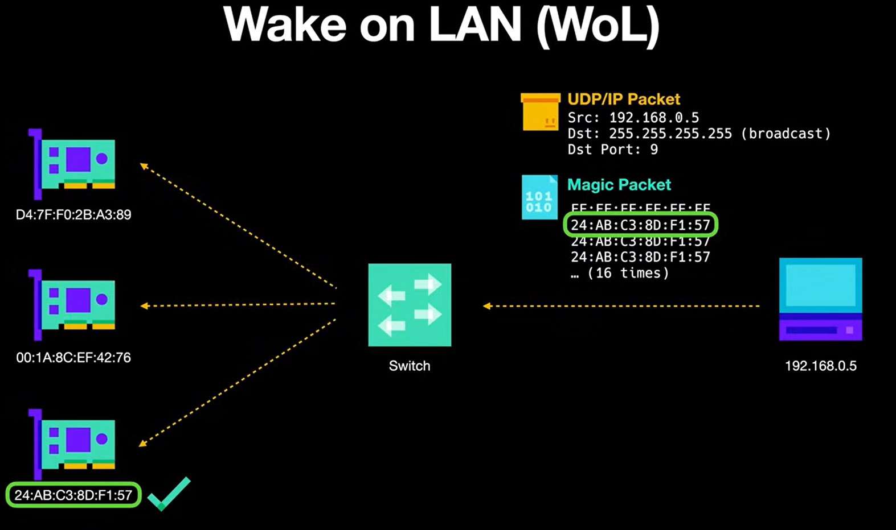

### **1. Introduction**
 ---
- Aim : Introducing a power on button to HPC.
- It will help to turn on and off the HPC.
- Objectives : Hardware Design, Network Configuration, WOL (Wake On LAN) 
  

 ### **2. Methodology**
 ---
1. How to connect a power button to motherboard?
    - Finding apporpraiate power button (momentary switch)
    - Finding the header for power button in motherboard (Front panel connector)
    - Configure BIOS setting ( In power management setting)

2. How to connect compute nodes and head node to enable the power buttons? (Hardware Design)
    - Needed components : Switch with maximum 11 ports (1 for header node and 10 for compute node) and ethernet cable (11 is enough)
        - Have to crimple ethernet cables following CAT 5E standards
    - Building appopriate node connections and power in motherboard
    - Network Configuration (Done through hard coded or DHCP)
    - Verfify the connections (Using ping command)
    - Mostly, in compute nodes don't need the front panel connection for button expect if want to reset 

3. How to enable power on button between head node and compute nodes? (Software design)
    - Enabling WOL (Wake On LAN) software package
        - Install WOL package
        - Get MAC address           (Same to what we are doing in network booting)
        - Send WOL packets to compute nodes
  

 ### **3. Implementation**
 ---

  

 ### **4. Helpful Resources**
 ---
1. The button can be find here: https://uk.rs-online.com/web/p/push-button-switches/2099127?cm_mmc=UK-PLA-DS3A-_-google-_-CSS_UK_EN_PMAX_RS+PRO-_--_-2099127&matchtype=&&gad_source=1&gclid=EAIaIQobChMIpP3xg7-mhAMVFAUGAB0t5QD5EAQYByABEgIy1_D_BwE&gclsrc=aw.ds

2. How to install WOL : https://pimylifeup.com/ubuntu-enable-wake-on-lan/#:~:text=Wake%2Don%2DLAN%20is%20a,functionality%20through%20your%20devices%20BIOS.

3. Power button and Front panel connections : https://www.pcinq.com/how-to-connect-motherboard-front-panel-headers/
                            https://www.electronicshub.org/power-button-on-motherboard/#:~:text=Ans%3A%20The%20power%20switch%20on,for%20the%2020-pin%20header
  

 ### **5. Images**
 ---
 
<b>Figure 1:Push button to be used in the HPC</b>
  

 
<b>Figure 2:Wake On LAN</b>
 

# The HPC’S purpose 
There are three sub-components to the HPC’S purpose in order for it to function fully. 

•	Background information on each selected crypto 
•	Recent fluctuations in the price and trading patterns 
•	Predicted outcomes and investment recommendation 
•	Choose operating system for Hpc 

## Background information on each selected crypto 
Cryptocurrency is a digital asset that is secured by cryptography. This type of money allows for decentralized transactions, meaning that a central authority, such as a bank, does not handle, verify, or regulate the transactions. An example of the information that the HPC could collect are, when the currency was made, how much its currently worth and the advantage and disadvantages to it like where it is and isn’t accepted

## Recent fluctuations in the price and trading patterns 
It is not unusual for the price of Bitcoin (BTC 0.72%) to fluctuate by 5% or even 10% every day. Wider price fluctuations can occur with smaller coins. because supply and demand, investors and users’ mood, laws, and media hype all have an impact. All these elements work together to cause price volatility. This will show use if the coin is on the right trajectory or if we should cut our losses 

## Predicted outcomes and investment recommendation 
In order for the HPC to figure out how to give suggestion that track with the current stats of the coin we will have to utilize machine learning. A field of computer science and artificial intelligence (AI) called "machine learning" focuses on using data and algorithms to simulate human learning processes and progressively increase their accuracy. By using machine learning we can utilize the information we gathered in the first two step to create an algorithm that can not only get you when to invest but how to invest with the hope that this will limit the risk in error my taking out the human error possibility 

## Combined step
Once all the above steps are combined, we should have a HPC that will be able to select and recommend cryptocurrency as well as improve itself the more and more the machine is used 

