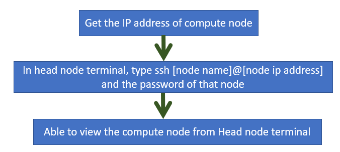

# **Open-SSH connection**

## **1. Background of SSH connection**

OpenSSH, or Open Secure Shell, is an open-source implementation of the SSH protocol. It provides secure communication between two or more computers over an unsecured network, ensuring data exchange confidentiality and integrity. OpenSSH is widely used in Linux and other Unix-like operating systems as the standard SSH implementation for remote administration, secure file transfer, and tunnelling other network services.In here, for High performance computing, using ssh over the built network can access the compute node terminals from the head node. 
 

 ## **2. Methodology of Open-SSH connection**

 ### **2.1 Installing Open-ssh connection**
 ---
                    sudo apt update

First, enter the above command, to update all the repositories in Linux OS

                    sudo apt install openssh-server

Then, enter install openssh-sever command and press yes to install the openssh.

                    sudo systemctl status ssh
Then, verify the installed status open ssh. It will show the ssh is active and loaded. Like this, similarly, installed SSH in all other nodes in the High-Performance Computing System.

### **2.2 Accessing compute nodes using Open-SSH connection**
---

                    sudo ufw allow ssh
When accessing compute nodes from head node, first have to enable the ssh available through firewall. The above command will enable the ssh through firewall service.

 
<b>Figure 1: Viewing the compute node from head node, using SSHr</b>
  