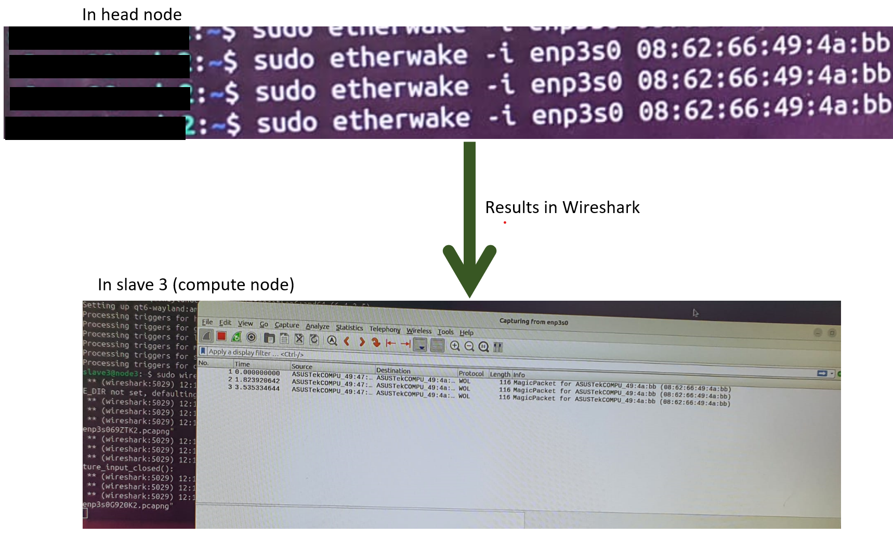

# **Power on and off function for HPC**

## **2. Implementation of power on and off function**

### **2.1 Setting up Wake-On-LAN magic packets communication**

 

 
<b>Figure 2: Implementing Wake-On-LAN between a head node and a compute node</b>
 

Following the letters and numbers on the above picture, below going to discuss the purpose of each line.

A. First, in the compute node BIOS, in the APM section related with power management, have to enable only the PCI-E/PCI, to enable Wake On LAN. It makes the compute node turn on when getting Wake on LAN magic packets only. Set the Restore AC Power LOSS to Power Off state.
1. To get the MAC address of compute node, which is a unique ID for the compute network interface.
2. To check the Wake-On-LAN state in the specific network interface. In initial, it will be d means disabled. Have to turn it on.
3. Here, making the Wake ON LAN activate by entering g at the end of the command.
4. However, after a reboot the WOL state will turn to d (disable). Therefore, have to make it persistent. In nm-connection-editor, by clicking magic, it will be persistent forever.
5. Reboot the compute node.
6. Verify whether the WOL is g or d state. It will be g, saying active state.
7. Install wireshark, which is a packet analyser. It will help to capture the incoming magic packets from compute node. Need only for testing purpose.
8. Install etherwake, to send Wake-On-LAN magic packets to compute node.
9. Sending a WOL magic packets to compute node, by specifying it’s network interface and MAC address.
10. Simultaneously, check whether the compute node receiving those packets by using wireshark GUI.
By following, the above steps successfully setup a Wake-On-LAN communication. 

### **2.2 Bash scripting for Wake-On-LAN**
After, setting up the WOL communication and Open-SSH, have to create a bash script to turn on and off the compute nodes, after booting up of head node. This step took due to the failure of power on and off button process. 

    #! /usr/bin/env bash

    #define MAC address in array for etherwake function
    declare -a WakeUpMacs = (“08:62:66:49:4a:b7” “08:62:66:4e:1f:a3” “08:62:66:4e:1f:67” “08:62:66:4d:3a:e9”)

    #define ssh with IP address in array for power off function
    declare -a shutDownHosts = (“slave1@192.168.0.11” “slave2@192.168.0.12” “slave3@192.168.0.13” “slave4@192.168.0.14”)

    if  [“$1” = “-on”]; then
        #wake-up commands
        for mac in “${WakeUpMacs[@]}” ; do
            sudo etherwake -i enp3s0 “$mac”
        done
    elif [“$1” = “-off”]; then
        #shutdown commands
        for host in “${shutDownHosts[@]}”; do
            ssh “$host” ‘sudo shutdown now’
        done 
    else
        echo “Usage: $0 -on | -off” 
    fi

<b>Figure 3: Bash script to power on and off compute nodes</b>
 

As shown in Figure 3 above, a bash script was created to turn off and on the compute nodes. As illustrated in the bash script, the MAC addresses of the compute nodes and the SSH with IP addresses were stored in an array. Next, to turn on the compute nodes, the etherwake function was used within a for loop, and to turn off the compute nodes, sudo shutdown with appropriate SSH was used within a for loop. Finally, to detect any inappropriate input, an echo message was created to instruct on the correct input format.

## **3. Testing power on and off function**

After the successful implementation of Wake On LAN, 3 tests have been conducted:

### **3.1. Wireshark testing**
---

 
<b>Figure 4: Wireshark testing</b>
 
<ul>
<li>Purpose: To verify that WoL magic packets are correctly formatted and successfully transmitted over the network to wake up targeted devices from a low-power state.</li>

<li>Method: Network traffic is captured and analysed using Wireshark during the attempt to wake a device using WoL. This involves sending a magic packet containing the target device's MAC address over the network and monitoring for its transmission and receipt. (shown in Figure 4)</li>

<li>Results: As shown in Figure 4, the testing confirms the magic packet reaches the intended device and is properly constructed, indicating the built network configurations support WoL functionality. Similary, the above test has conducted across all compute nodes with head node. </li>
</ul>

### **3.2. Bash script power on testing**
---
<ul>
<li>Purpose: To verify whether the created bash script turns on the compute nodes from the head node.</li>

<li>Method: After the head node successfully boots up, the script name and the appropriate “-on” command have to be entered.</li>

<li>Results: As a result, the head node will not print anything in the terminal. The compute nodes start to turn on one by one as mentioned in the script's for loop.</li>
</ul>

### **3.3. Bash script power off testing**
---
<ul>
<li>Purpose: To verify whether the created bash script turns off the compute nodes.</li>

<li>Method: After successful power-on testing of the compute nodes, a power-off test is conducted. For that, similarly, enter the script’s name followed by the “-off” command.</li>

<li>Results: As a result, the head node will not print anything in the terminal. The compute nodes begin to turn off one by one as mentioned in the script's for loop.</li>
</ul>

 ## **4. Helpful Resources**

1. How to install WOL : https://pimylifeup.com/ubuntu-enable-wake-on-lan/#:~:text=Wake%2Don%2DLAN%20is%20a,functionality%20through%20your%20devices%20BIOS.
  