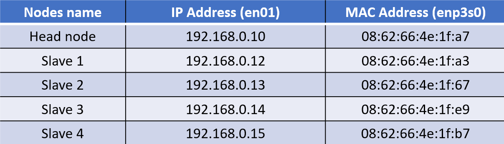

# **Networking with nm-connection-editor**
 
## **1. Background of nm-connection-editor**

The nm-connection-editor helps to create new network connections and manage existing network connections in Linux OS. It is a GUI based application.

                sudo nm-connection-editor

By typing the above command in Linux terminal, user can start the nm connection editor application. It is only available in GUI (desktop or GNOME) environment. To instead work with terminal, can use nm-cli connection. It available in all platforms such as terminal, desktop and ssh,or instead, can use nmtui, it is a curses-based application. It works on terminal and desktop and support all the feature of network manager.

<b>Table 1: Comparing nmtui and nm-connection-editor</b>
 
  

## **2. Methodology of nm-connection-editor implementation**
 
### **2.1 How to add a new network connection with nm-connection-editor**
---
 

 
<b>Figure 1:Flow diagram to add a new network connection in nm-connection-editor</b>
  

(Note: The above flow chart, made in consideration of following static IP address configuration and HPC purpose only.)

In the head node, the nm-connection editor saves all the network configuration files in etc/sysconfig/network-scripts/ directory.

                    sudo nmcli connection show

By using the above command, can verify the made network connections.

                    sudo nmcli connection up [Network Connection name]
By using the above command, can activate the specific network connection.

                    sudo ip address show [Network interface]

After activating network connection, can view the IP configuration of the specific device.
 

## **2.2 How to edit a network connection with nm-connection-editor**
---

 
<b>Figure 2:Flow diagram to edit network connection in nm-connection-editor</b>
  

                    sudo nmcli connection down [Network Connection name]
		            sudo nmcli connection up [Network Connection name]
After customisation, the Network Manager/ Net plan won’t change the customise options. Therefore, must manually change the customisation by shutting down and turning on network connection.

                    sudo ip address show [Network Interface]
Verify the customised  IP address changed/ updated.
 

 ### **2.3 How to delete a network connection with nm-connection-editor**
 ---
 
 
<b>Figure 3:Flow diagram to delete a network connection in nm-connection-editor</b>
  

                    sudo nmcli connection show 
Can verify the connection above was deleted.
 

## **3. Networking implemenatation for HPC**

### **3.1 Network bridging**
---

To implement networking for this project, have used the network bridging format. It has been enabled with two ethernet cables, as follows:
<ol>
<b><li> Internet Sharing Cable</li></b>
<ul>
<li>	Purpose: Used to provide internet access to all network devices in the HPC. </li>

<li>	How it Functions: The HPC's head node has an internet connection through the Wi-Fi adapter, but the other compute nodes do not. Therefore, to share the internet connection with the other compute nodes, this internet sharing cable was established.</li>

<li>	Assigned Port (NIC) Name: en01</li>
</ul>
<b><li> Data Sending Cable</li></b><ul>
<li>Purpose: Used to share data packets or facilitate intra-communication between the nodes in the HPC.</li>

<li>How it Functions: In the HPC, most of the function inputs and packet installations occur in the head node. However, to enable parallel processing, the installed packets have to be present in both the compute node and the head node. Furthermore, the head node must send inputs or tasks to the compute nodes to perform. Therefore, an intra-communication link is needed. To fulfill this purpose, these data sending cables were established on all nodes’ NICs.</li>

<li>Assigned Port (NIC) Name: enp3s0 </li>
</ol>

### **3.2 Static IP Address**
---
After establishing network connections, it is necessary to assign an IP address to each node to uniquely identify each one in the HPC network. Therefore, we use static IP address configuration. A static IP address means manually assigning an IP address to network devices. In this case, a Class C IPv4 address is used. The given subnet mask is /24 or 255.255.255.0.The assigned IP addresses are shown below in Table 2. Additionally, the table contains the MAC address of each node.

<b>Table 2: IP Address and MAC Address of each node</b>
 
 

### **3.3 Network implmentation in HPC using nm-connection editor**
---

 ## **4. Testing networking implementation**

 ## **5. Helpful Resources**
 1. How to implement nm-connection editor: https://help.ubuntu.com/community/NetworkManager

